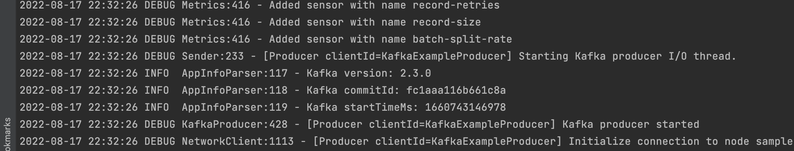
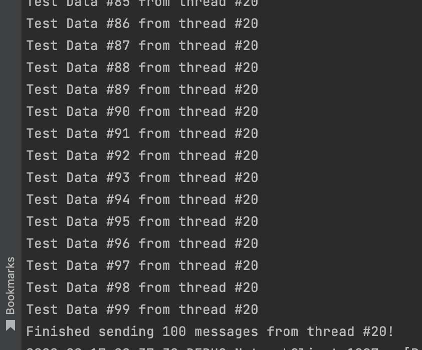
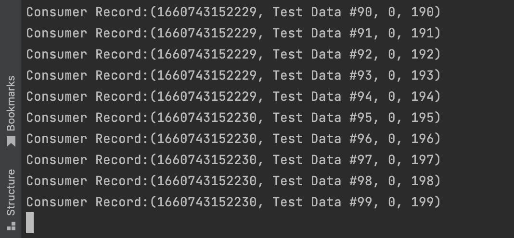
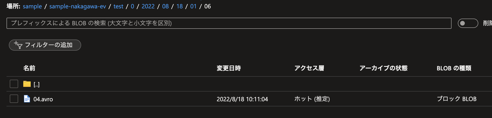

[以前の記事](../using-event-hubs-from-apach-kafka-application/index.md)では Event Hubs のクイックスタートにて、Event Hubs と Spring Boot アプリケーションをつなげる方法について調べた。
Event Hubs と Kafka アプリケーションを繋げるには[こちらのクイックスタート](https://github.com/Azure/azure-event-hubs-for-kafka/tree/master/quickstart/java)を使用すればパラメータを設定するだけで簡単にできた。
ただし **Event Hubs のレベルは kafka プロトコルに対応したい場合だと Basic では動かないため、Standard にする必要がある**

その際に、Event Hubs <-> Kafka アプリケーション間で発生するイベントをキャプチャすることができるようだったので[設定](https://docs.microsoft.com/ja-jp/azure/event-hubs/event-hubs-capture-enable-through-portal?WT.mc_id=Portal-Microsoft_Azure_Support)してみた。（Azure Blob Storage で行った）
なお、操作は IntelliJ 上で行っているが、アプリの実行はターミナルで実施した。

## キャプチャが保存されたことを確認する
### 前提
- 当該リポジトリを clone 済みであり、適切なパラメータが設定済みであること
- リポジトリの README.md に記載のある条件をクリアしていること
### TestProducer を起動する
producer のルートディレクトリで以下を実行する
```bash
mvn clean package
mvn exec:java -Dexec.mainClass="TestProducer"
```
起動すると以下のようなログがターミナルに出力される。

デフォルトでは起動時に100メッセージが送られるような設定となっているため、送信が完了した場合は以下のようなログが出力される。



### TestConsumer を起動する
consumer のルートディレクトリで以下を実行する
```bash
mvn clean package
mvn exec:java -Dexec.mainClass="TestConsumer"
```



### Blob を確認する

設定しておいたストレージアカウントの指定コンテナに以下のように保存されることが確認できた。100メッセージを同時に送っているためデフォルトでは日時別に保存されている。


# 終わりに
ファイル内をみるには[この辺り](https://github.com/microsoft/AzureStorageExplorer)を使う必要がありそう

# References
- 公式ドキュメントだと以下のあたりが参考になりそう。
  - [Event Hubs からストリーム配信されるイベントのキャプチャを有効にする方法](https://docs.microsoft.com/ja-jp/azure/event-hubs/event-hubs-capture-enable-through-portal?WT.mc_id=Portal-Microsoft_Azure_Support)
  - [Event Hubs のキャプチャの仕組み](https://docs.microsoft.com/ja-jp/azure/event-hubs/event-hubs-capture-overview)
  - [Avro 形式でのファイルのキャプチャ](https://docs.microsoft.com/ja-jp/azure/event-hubs/event-hubs-capture-overview?WT.mc_id=Portal-Microsoft_Azure_Support#exploring-the-captured-files-and-working-with-avro)
- https://simon-aubury.medium.com/kafka-with-avro-vs-kafka-with-protobuf-vs-kafka-with-json-schema-667494cbb2af
  - なぜ Avro がデフォルトなのかなーと思い調べたところ Java だと Avro の方が人気なのはわかった