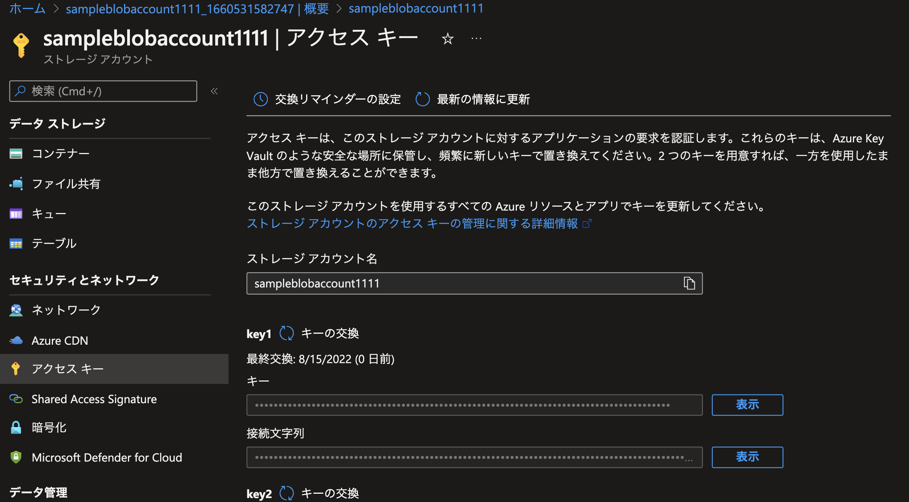

[Azure Storage の接続文字列を構成する](https://docs.microsoft.com/ja-jp/azure/storage/common/storage-configure-connection-string)に沿って調査していく中でわかったことなどをまとめていく。

# アクセスキーとは

## アクセス キーの保護
- ストレージ アカウントのアクセス キーは、アカウントの root パスワードのようなもの
- アクセス キーを他のユーザーに配布したり、ハードコーディングしたり、他のユーザーがアクセスできるプレーンテキストで保存したりしてはいけない
> BLOB およびキューのデータに対する要求を認可するには、アカウント キー (共有キーによる認可) を使用するのではなく、**可能であれば Azure Active Directory (Azure AD) を使用することをお勧めします。** Azure AD を使用して認可すると、共有キーによる認可よりも優れたセキュリティと使いやすさが実現されます。

## アクセスキーを取得するには
- アプリケーションは実行時に接続文字列にアクセスして、Azure Storage に対する要求を承認する必要がある
- [ストレージ アカウント アクセス キーを管理する](https://docs.microsoft.com/ja-jp/azure/storage/common/storage-account-keys-manage?tabs=azure-portal) を参考に以下のように取得できる

## アクセスキーを管理するソリューション
- アクセスキーをソースコードなどに直書きすることはパスワードを晒すことを同等となるため、対策が必要
  - Key Vault を使用することもできるが、**SAS を利用する方がセキュリティ上好まれそう**（構成するためのアップデートが終わっているため）
- アクセスキーを紛失したり晒した可能性がある場合は、直ちに[アクセスキーのローテーション](https://docs.microsoft.com/ja-jp/azure/storage/common/storage-account-keys-manage?tabs=azure-portal#manually-rotate-access-keys)を行う方が良い
- SAS でも有効期限が設定できるが、[アクセスキー自体にも有効期限を設定する](https://docs.microsoft.com/ja-jp/azure/storage/common/storage-account-keys-manage?tabs=azure-portal#create-a-key-expiration-policy)ことが可能
- 今回は SAS を使用した構成方法について以下にまとめる

# Shared Access Signatures (SAS) を使用して Azure Storage リソースへの制限付きアクセスを許可する

## Shared Access Signature (SAS) とは
> Shared Access Signature (SAS) は、Azure Storage リソースに対する制限付きのアクセス権を付与する URI です。ストレージ アカウント キーを渡すことはできないが、特定のストレージ アカウントのリソースへのアクセスを委任したいクライアントには Shared Access Signature を提供できます。このようなクライアントに Shared Access Signature URI を配布することで、指定した期間にリソースへのアクセスを許可します。

### Shared Access Signature を使用してアクセスを委任する
https://docs.microsoft.com/ja-jp/rest/api/storageservices/delegate-access-with-shared-access-signature
https://github.com/Azure/azure-sdk-for-java/blob/main/sdk/storage/azure-storage-blob/src/samples/java/com/azure/storage/blob/BasicExample.java#L38
## Shared Access Signature (SAS) の種類
## SAS トークンとは
- SAS トークンは、クライアント側で生成する文字列
- たとえば、Azure Storage クライアント ライブラリのいずれかを使用します。
- SAS トークンは、Azure Storage によって追跡されない
- リソース URI と その SAS トークンを示すサービス SAS URI の例は以下のように

## SAS を使用する際のベスト プラクティス

# References
- https://docs.microsoft.com/ja-jp/rest/api/storageservices/create-user-delegation-sas