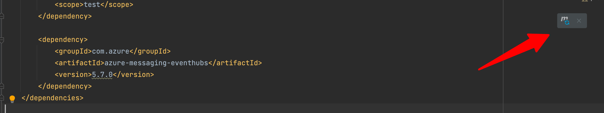

# Event Hubs とは

[Azure Event Hubs](https://docs.microsoft.com/ja-jp/azure/event-hubs/event-hubs-about) は、データをある場所から別の場所に転送して更なる処理や分析をするためのストリーミングデータインジェストサービスのこと。なんらかのデータイベントが発生するたびにストリーミング処理を行うことからイベントインジェスターともいう。

イベントインジェスターとは、例えば [イベント駆動ドリブン](https://docs.microsoft.com/ja-jp/azure/architecture/guide/architecture-styles/event-driven) はイベントパブリッシャー・イベントコンシューマーを構成するが、そのイベントを処理するためにイベントパブリッシャーとイベントコンシューマーの間に置かれる。

Event Hubs はフルマネージドの PaaS であるため、Kafka などを用いたい場合におけるクラスター管理・構成などの設計・構築が大幅に軽減される。
今回は Event Hubs を使用して Kafka アプリケーションを使用する手順に関してまとめていく。

# やってみる
## リソースを準備する
- Event Hubs を構築するには [公式のクイックスタート](https://docs.microsoft.com/ja-jp/azure/event-hubs/event-hubs-create) を活用すると良さそう。
- ソースコードに関しては、公式が提供している [Java を使用して Azure Event Hubs との間でイベントを送受信する (azure-messaging-eventhubs)](https://docs.microsoft.com/ja-jp/azure/event-hubs/event-hubs-java-get-started-send) の手順に沿ってサンプル実装を行う
  - 補足：Kafka アプリケーションを Java で書いているため今回は Java で試す。
  - 送信イベント用 Maven プロジェクトと受信イベント用 Maven プロジェクトを作成して送受信を試す
  - 以後は **注意点のみ記載しているため詳細な手順は上記チュートリアルを確認すること**

## 送信イベント用 Maven プロジェクトの注意点
### Maven で作成した Empty Project の pom.xml に以下を追加する。
```xml
    <dependency>
        <groupId>com.azure</groupId>
        <artifactId>azure-messaging-eventhubs</artifactId>
        <version>5.7.0</version>
    </dependency>
```
- この際、必ず Maven をリロードすること。


### Event Hubs へ接続する際に使用する接続文字列の取得方法
```
Endpoint=sb://<NamespaceName>.servicebus.windows.net/;SharedAccessKeyName=<KeyName>;SharedAccessKey=<KeyValue>
```

- 詳細については[こちら](https://docs.microsoft.com/ja-jp/azure/event-hubs/event-hubs-get-connection-string)に確認手順が書かれているため参照のこと。


## 受信イベント用 Maven プロジェクトの注意点
### Azure Storage と BLOB コンテナーを作成する
Azure Storage Blob に関する概要は[別記事](../what-is-blob/)にまとめた。

### 依存関係の追加
- 送信イベント用プロジェクトと同様に pom.xml ファイルを更新後リロードすることを忘れないようにする

# 終わりに
手順どおりにやればかなり簡単にできた。次は[こちら](https://github.com/Azure/azure-event-hubs-for-kafka/tree/master/quickstart/java)を試す


# References
- https://docs.microsoft.com/ja-jp/azure/event-hubs/event-hubs-for-kafka-ecosystem-overview
- https://buildersbox.corp-sansan.com/entry/2020/11/06/110000
  - Advanced Message Queuing Protocol (AMQP) とは Azure Event Hubs でも使われている代表的なメッセージングプロトコルの一つ。
- https://docs.microsoft.com/ja-jp/azure/event-hubs/event-hubs-scalability#partitions
    > パーティションは "コミット ログ" として考えることができます。 イベント本体、イベントを表すユーザー定義のプロパティ バッグ、メタデータ (パーティションにおけるオフセット、ストリーム シーケンスにおける番号、イベントが受理されたサービス側のタイムスタンプなど) を含んだイベント データがパーティションに格納されます。